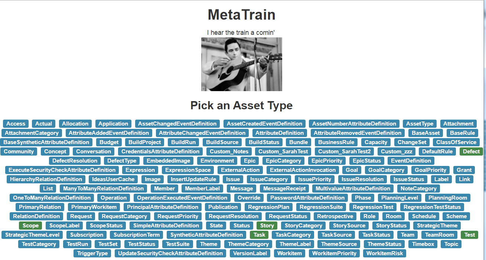

# Get on that train

https://www.youtube.com/watch?v=UZkrVSB4uAw

# Running it

* Clone the repo
* `cd VersionOne.MetaTrain`
* `npm install -g nws`
* `nws`
* You will have to modify a few URLs in the `app.coffee` file if you want to use your own instance and you'll need to grab your `ticket` value from your browser's cookies to update that too near the bottom of the file.

# What to do

First, pick an Asset Type from which to start building your query:

Next, you can:

* Add attributes to the `select` list by clicking on the checkmark near an attribute name
* Specify one or more filter criteria and **OR** values within a single filter by clicking the filter icon near an attribute name
* For relationships, click the checkmark near the attribute name to overlay the attributes for that relationship onto the panel.
  * Press the `back` link to go back to the parent asset type

  
