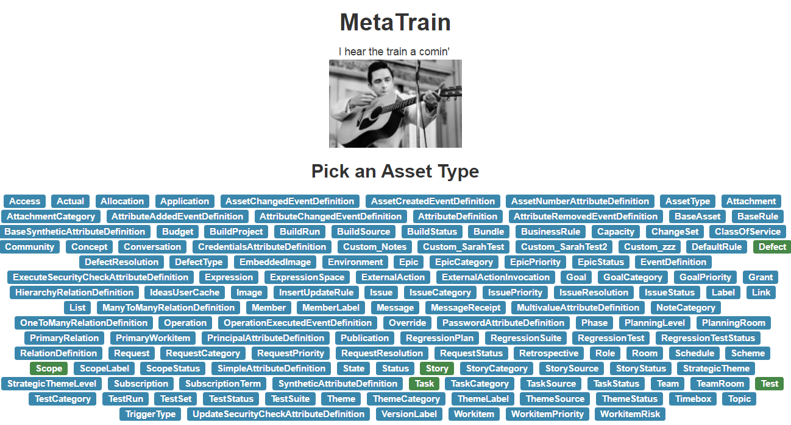
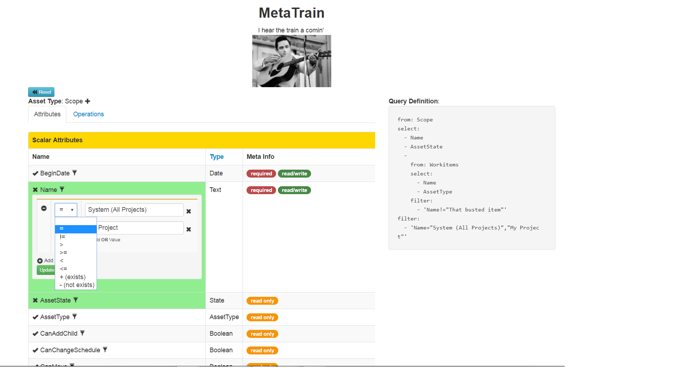

# Get on that train

http://screencast.com/t/hMR3R8VEt *

# Running it

* You will need to run a proxy that can broker request to your VersionOne instance, since VersionOne does not support CORS. We use the `post` branch of this fork of `crossorigin.me`: [https://github.com/Pmmlabs/crossorigin.me/tree/post](https://github.com/Pmmlabs/crossorigin.me/tree/post). Running that branch opens a proxy at `http://localhost:8080`, which is the default location in the code.
* Clone the repo* 
* `cd VersionOne.MetaTrain`
* `npm install -g nws`
* Be sure tu have installed gulp-cli. if not run: `npm install --global gulp-cli`
* `npm install`
* `npm gulp` -> compile this project 
* `nws`
* You will have to modify a few variables in the `app.js` file if you want to use an instance other than `http://localhost/VersionOne.Web`. Rmember run `gulp` every time you modified this file to get the compiled version
* And, you'll need to grab your `ticket` value from your browser's cookies to update that in the code.

## The configuration variable defaults are:

```ES6
const proxyUrl = 'http://localhost:8080';
const v1HostUrl = 'http://localhost';
const v1InstanceName = 'VersionOne.Web';
const v1Ticket = 'HFZlcnNpb25PbmUuV2ViLkF1dGhlbnRpY2F0b3IUAAAABWFkbWlurDxBxOzP0wj/Pzf0dSjKKxAGqf4JFIdBMgObRKtwQRP1';
```


# What to do

First, pick an Asset Type from which to start building your query:



Next, you can:

* Add attributes to the `select` list by clicking on the checkmark near an attribute name
* Specify one or more filter criteria and **OR** values within a single filter by clicking the filter icon near an attribute name
* For relationships, click the checkmark near the attribute name to overlay the attributes for that relationship onto the panel.
  * Press the `back` link to go back to the parent asset type

  

# Credits

[Folsom Prison Blues](https://www.youtube.com/watch?v=UZkrVSB4uAw) by Johnny Cash

Meta's a powerful system, but without the training or the rails to guide you, it feels like this sometimes:

```text
I hear the train a comin'
It's rolling round the bend
And I ain't seen the server since I don't know when,
I'm stuck in Meta prison, and code keeps draggin' on
But that train keeps a rollin' on down to Paraná
When I was just a newbie my sherpa told me: Dev,
Always be a good dev, don't ever play with SQL.
But I dropped a database in Hostess just to watch it crash
When I see that story planning, I hang my head and cry..

I bet there's new teams coding with that fancy GraphQL
They're probably drinkin' Kool Aid and taking Hookah puffs.
Well I know I had it coming, I know I can't be free
But those devs keep a learnin'
And that perplexes me...

Well if they freed me from this prison,
If that query plan was mine
I bet I'd get the feature out a little faster all the time
Far from Meta prison, that's where I want to stay
And I'd let that lonesome cursor blink those bits away....
```

